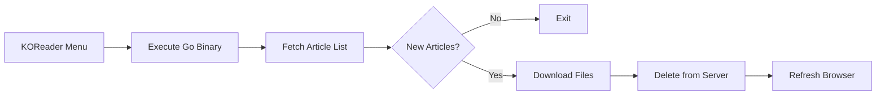

The Klip KOReader plugin syncs articles from your server directly to your e-reader. It handles downloading new content and cleaning up articles from the server after successful transfers.

## Setting up the plugin

Before you can sync, configure the plugin in KOReader.

<Steps>
  <Step title="Install the plugin">
    Copy the `klip.koplugin` folder to your device's KOReader plugins directory:
    
    ```bash
    # For Kindle devices
    /mnt/us/koreader/plugins/klip.koplugin/
    ```
    
    The plugin includes a Go binary that handles the actual sync process.
  </Step>
  
  <Step title="Restart KOReader">
    Restart KOReader to load the plugin. You should see "Klip Sync" in the main menu.
  </Step>
  
  <Step title="Configure server URL">
    Open the KOReader menu and select **Klip Sync**. Tap **Server URL** and enter your Klip server address:
    
    ```
    http://192.168.1.50:3000
    ```
    
    The plugin automatically adds `http://` if you omit the protocol.
  </Step>
  
  <Step title="Set download folder">
    Tap **Download Folder** and select where articles should be saved on your device. The default is:
    
    ```
    /mnt/us/documents/Klip
    ```
    
    The plugin creates this folder automatically if it doesn't exist.
  </Step>
</Steps>

<Info>
Your configuration is saved to `klip.koplugin/klip/config.json` and persists across restarts.
</Info>

## Syncing articles

Once configured, you can sync articles from the KOReader menu.

### Manual sync

<Steps>
  <Step title="Open the menu">
    Tap the top of the screen to open the KOReader menu.
  </Step>
  
  <Step title="Navigate to Klip Sync">
    Scroll to **Klip Sync** in the menu.
  </Step>
  
  <Step title="Tap Sync Now">
    Select **Sync Now** to start the sync process.
    
    You'll see a message: "Syncing with Server..."
  </Step>
  
  <Step title="Wait for completion">
    The sync typically takes a few seconds. When complete, you'll see:
    
    - **Sync Complete** - Articles downloaded successfully
    - **Sync Failed** - Check crash.log for errors
  </Step>
</Steps>

<Tip>
After a successful sync, your file browser automatically refreshes to show the new articles.
</Tip>

## How sync works

The sync process follows a specific workflow to ensure reliability.

### Sync workflow



### Step-by-step process

<Steps>
  <Step title="Plugin triggers sync">
    When you tap "Sync Now", the Lua plugin executes the Go binary (from `main.lua:108`):
    
    ```lua
    local cmd = string.format("cd %s && ./%s > /dev/null 2>&1", 
        plugin_path, binary_path_relative_to_plugin_path)
    local result = os.execute(cmd)
    ```
  </Step>
  
  <Step title="Binary fetches article list">
    The Go binary calls the `/sync` endpoint to get available articles (from `main.go:105-125`):
    
    ```go
    func fetchArticles(url string) ([]Article, error) {
        resp, err := http.Get(fmt.Sprintf("%s/sync", url))
        if err != nil {
            return nil, err
        }
        
        defer resp.Body.Close()
        
        var articles []Article
        err = json.NewDecoder(resp.Body).Decode(&articles)
        return articles, err
    }
    ```
    
    The server responds with a list of files:
    
    ```json
    [
      {
        "filename": "01932e4a-7b8c-7890-a1b2-c3d4e5f6a7b8.epub",
        "download_url": "http://192.168.1.50:3000/01932e4a-7b8c-7890-a1b2-c3d4e5f6a7b8.epub"
      }
    ]
    ```
  </Step>
  
  <Step title="Download new articles">
    The binary checks if each file already exists locally. If not, it downloads the file (from `main.go:127-146`):
    
    ```go
    func downloadArticle(url, path string) error {
        resp, err := http.Get(url)
        if err != nil {
            return err
        }
        defer resp.Body.Close()
        
        file, err := os.Create(path)
        if err != nil {
            return err
        }
        
        _, err = io.Copy(file, resp.Body)
        return err
    }
    ```
  </Step>
  
  <Step title="Clean up server">
    After successful downloads, the binary tells the server to delete those files (from `main.go:148-172`):
    
    ```go
    func batchDeleteArticlesFromServer(url string, articles []string) error {
        body := struct {
            Files []string `json:"filenames"`
        }{
            Files: articles,
        }
        
        jsonPayload, err := json.Marshal(body)
        if err != nil {
            return err
        }
        
        resp, err := client.Post(
            fmt.Sprintf("%s/clips/batch-delete", url), 
            "application/json", 
            bytes.NewBuffer(jsonPayload)
        )
        return err
    }
    ```
    
    This prevents re-downloading the same articles on future syncs.
  </Step>
</Steps>

## Plugin configuration

The plugin stores settings in JSON format at `klip.koplugin/klip/config.json`:

```json
{
  "server_url": "http://192.168.1.50:3000",
  "download_path": "/mnt/us/documents/Klip"
}
```

You can edit this file manually if needed, but it's recommended to use the menu interface.

### Default configuration

If no config file exists, the plugin uses these defaults (from `main.lua:185-188`):

```lua
self.config = {
    server_url = "http://192.168.1.50:3000",
    download_path = "/mnt/us/documents/Klip",
}
```

## Troubleshooting sync issues

<Note>
If sync fails, KOReader logs detailed errors to `crash.log` in your KOReader directory.
</Note>

### Common issues

| Issue | Solution |
|-------|----------|
| "Sync Failed" message | Check that the server URL is correct and accessible from your device |
| Plugin doesn't appear | Verify the Go binary exists at `klip.koplugin/klip/klip` and is executable |
| Articles don't download | Ensure the download folder exists and has write permissions |
| Files download but sync fails | The batch delete request may be timing out - check server logs |

### Testing the sync endpoint

You can manually test the sync endpoint from any device:

```bash
curl http://192.168.1.50:3000/sync
```

This should return a JSON array of available articles.

## Network requirements

<Info>
Your e-reader must be on the same network as your Klip server, or the server must be publicly accessible.
</Info>

For local network access:
- Use your server's local IP address (e.g., `192.168.1.50:3000`)
- Ensure your firewall allows connections on the server port

For remote access:
- Expose your server through a reverse proxy or VPN
- Update the `DOWNLOAD_URL` environment variable to match your public URL
